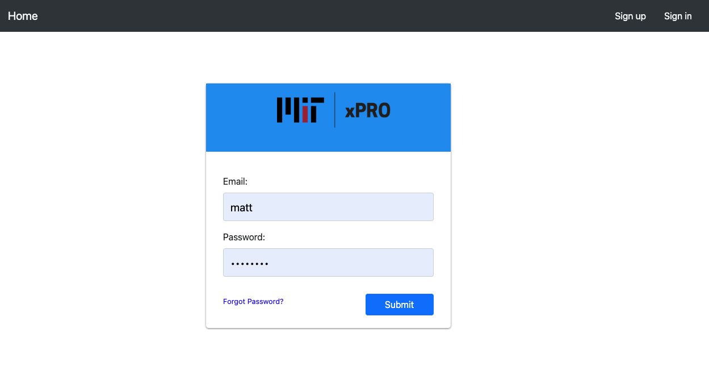

# Restaurant-app ReadMe
## Capstone Project

TITLE:
Full stack restaurant ordering application

DESCRIPTION:
This is a full stack next.js/react web application for ordering food from restaurants.

HOW TO RUN:
Navigate to the restaurant-app directory using a terminal. 

FRONTEND:
Install the NVM and NPM packages. Refer to package.json for dependancies.
Run npm install and npm run dev from the main directory

BACKEND:
Change directory to the backend.
Install the NVM and NPM packages. Refer to package.json for dependancies.
Run npm install, npm run build, and and npm run start.

ROADMAP:
Planning to make changes to the bootstrap styling to support mobile devices.

LICENSE INFORMATION:
Licensing information can be found in the restaurant-app repo locate the "LICENSE" file.